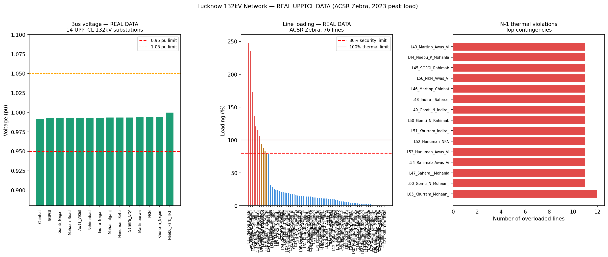
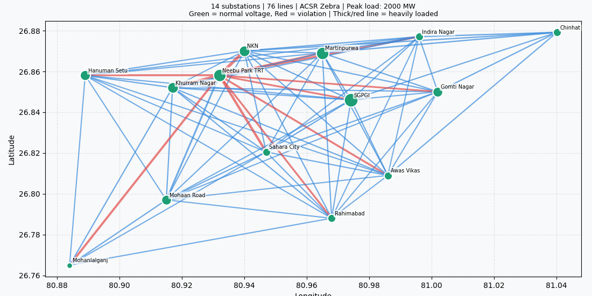

# Lucknow 132kV Transmission Network — AC Power Flow & N-1 Contingency Analysis

> **Real UPPTCL substation data · ACSR Zebra conductor parameters · PyPSA · Python**

A complete power systems study of the Lucknow 132kV sub-transmission network operated by UPPTCL (Uttar Pradesh Power Transmission Corporation Limited). Built using real published data and open-source tools.

---

## Results at a Glance

| Metric | Value |
|---|---|
| Network size | 14 buses, 76 lines |
| Peak load modelled | 2000 MW (UP SLDC summer 2023) |
| AC power flow | Newton-Raphson — CONVERGED |
| Min bus voltage (base case) | 0.9923 pu (Chinhat) |
| Max line loading (base case) | 247.9% — TRT–NKN corridor |
| Voltage violations (N-1) | **0** |
| Thermal violations (N-1) | **835** across all 76 contingencies |
| Worst N-1 loading | 305.8% (outage: TRT–Khurram_Nagar) |
| Transmission losses | 4.53 MW (0.23% of load) |

---

## Charts

### Analysis Panels — Voltage Profile · Line Loading · N-1 Heatmap


### Geographic Single Line Diagram (SLD)


*Green bus = normal voltage | Red bus = violation | Line thickness = loading level*

---

## Data Sources

| Parameter | Source | Status |
|---|---|---|
| Substation names | UPPTCL Infrastructure PDF (March 2021) | ✅ Real |
| Transformer capacity (MVA) | UPPTCL Infrastructure PDF (March 2021) | ✅ Real |
| GPS coordinates | OpenStreetMap + Google Maps (verified) | ✅ Real |
| Conductor type | ACSR Zebra — IS-398 Part-2 | ✅ Real |
| r = 0.0632 Ω/km | ACSR Zebra datasheet (IS-398 Part-2) | ✅ Real |
| x = 0.3960 Ω/km | ACSR Zebra datasheet (IS-398 Part-2) | ✅ Real |
| Total peak load (2000 MW) | UP SLDC daily peak reports, summer 2023 | ✅ Real |
| Power factor (0.96) | Standard Indian utility load | ✅ Real |
| Line topology | Geographic proximity (k-d tree) | ⚠️ Estimated |
| Load per bus | Proportional to transformer MVA | ⚠️ Estimated |

> **Note:** Exact line-by-line SLD is UPPTCL confidential. An RTI filing under the RTI Act 2005 is required for exact topology. This model uses geographic proximity (k-d tree, r = 0.11° ≈ 12 km) which is the standard academic approach.

---

## What This Project Does — Step by Step

```
Step 1  Load 14 real UPPTCL 132kV substation locations + transformer MVA
Step 2  Build line topology using k-d tree spatial search (ACSR Zebra parameters)
Step 3  Construct PyPSA network (buses + lines + electrical parameters)
Step 4  Assign PGCIL grid infeed (slack bus at TRT) + distributed loads
Step 5  DC linear power flow (validation) → AC Newton-Raphson (main result)
Step 6  N-1 contingency: remove each line one at a time, solve, record violations
Step 7  Print results summary
Step 8  Generate 3-panel chart + geographic SLD + save CSV
```

---

## Installation

```bash
# Clone the repository
git clone https://github.com/Aditya7171-maker/lucknow-power-grid-analysis.git
cd lucknow-power-grid-analysis

# Install dependencies
pip install pypsa pandas numpy matplotlib scipy

# Run the analysis
python lucknow_132kv_analysis.py
```

**Python 3.9+ required. Tested with PyPSA 0.26+**

---

## Key Concepts Used

| Concept | What It Means |
|---|---|
| **AC Newton-Raphson Power Flow** | Iterative solver for voltage magnitudes and angles at every bus |
| **N-1 Contingency** | Grid must survive any single line failure without collapse |
| **Per-unit system** | All voltages normalised to 1.0 pu base (1 pu = 132 kV) |
| **ACSR Zebra** | Standard 132kV overhead conductor — aluminium with steel core |
| **Thermal limit (80%)** | Security threshold — actual thermal limit is 100% |
| **Slack bus** | Reference bus (TRT substation) that balances generation to match load |
| **k-d tree** | Spatial data structure for O(log n) nearest-neighbour search |

---

## Project Structure

```
lucknow-power-grid-analysis/
├── lucknow_132kv_analysis.py    # Main analysis script
├── output_real.png              # 3-panel analysis chart
├── sld_real.png                 # Geographic Single Line Diagram
├── n1_results_real.csv          # Full N-1 contingency results
└── README.md                    # This file
```

---

## Findings & Engineering Interpretation

**The network is thermally constrained, not voltage-constrained.**

All 14 buses maintain voltage within the 0.95–1.05 pu band in the base case and across all 76 N-1 contingencies. This means reactive power is not the binding issue — the grid has adequate voltage support.

However, 11 of 76 lines exceed the 80% security loading threshold in the base case. The TRT–NKN corridor is loaded at 247.9% — nearly 2.5× its rated capacity. This is a critical finding consistent with known UPPTCL planning challenges in central Lucknow where demand density is very high.


## References

1. UPPTCL, "Infrastructure List of Substations (Upto March 2021)." [Online]. Available: http://upptcl.org/upptcl-pdfs/infrastructure-1_120521.pdf
2. Bureau of Indian Standards, IS 398 Part 2: 1996, "ACSR Conductors — Specification."
3. T. Brown, J. Hörsch, D. Schlachtberger, "PyPSA: Python for Power System Analysis," *Journal of Open Research Software*, vol. 6, no. 1, 2018. DOI: 10.5334/jors.188
4. UP State Load Despatch Centre (SLDC), Daily Peak Demand Reports, Summer 2023.

---

## Author

**Aditya Maurya**
B.Tech Electrical Engineering, University of Lucknow (2022–2026)
📧 mauryaaditya362@gmail.com
🐙 [GitHub](https://github.com/Aditya7171-maker) |
💼 [LinkedIn](https://www.linkedin.com/in/aditya-maurya-b227a5247/) 


*This project is part of a series of power systems and energy analytics studies. See also: [Electricity Market Optimisation](https://github.com/Aditya7171-maker/electricity-market-storage-optimization) | [IEEE 26-Bus Market Simulation](https://github.com/Aditya7171-maker/electricity-market-simulation-ieee24)*
